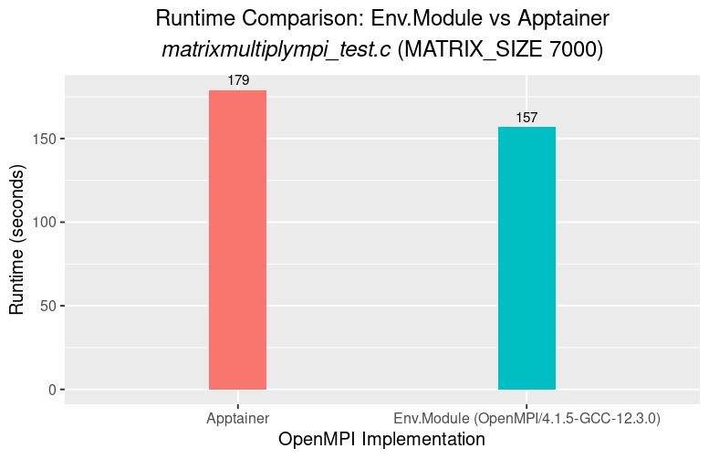

# OpenMPI-Apptainer

There are few additional `UCX` variables in the definition file which may not get used during runtime. They will trigger a warning which can be silenced with `UCX_WARN_UNUSED_ENV_VARS=n`

* For an example, `srun --mpi=pmi2 apptainer exec --env UCX_WARN_UNUSED_ENV_VARS=n openmpi-4.1.5.aimg ./matrixmultiply_test` 


## Slurm template for the tests

```bash
#!/bin/bash -e

#SBATCH --job-name=mpi_test
#SBATCH --nodes=4
#SBATCH --ntasks-per-node=2
#SBATCH --mem-per-cpu=2G
#SBATCH --time=00:10:00
#SBATCH --output=slog/%j.out

# Load any necessary modules here if required
module purge
module load  Apptainer
#Compile
#apptainer exec openmpi.sif mpicc -o tests/mpi_test mpi_test.c
#apptainer exec openmpi-4.1.5.aimg mpicc -o matrixmultiply_test tests/matrixmultiplympi_test.c -lm

# Run the MPI test program
srun --mpi=pmi2 apptainer exec --env UCX_WARN_UNUSED_ENV_VARS=n openmpi-4.1.5.aimg ./matrixmultiply_test
```

##  *OpenMPI/4.1.5-GCC-12.3.0* vs *Apptainer* runtime comparison for  `matrixmultiplympi_test.c` ( `MATRIX_SIZE 7000`)

